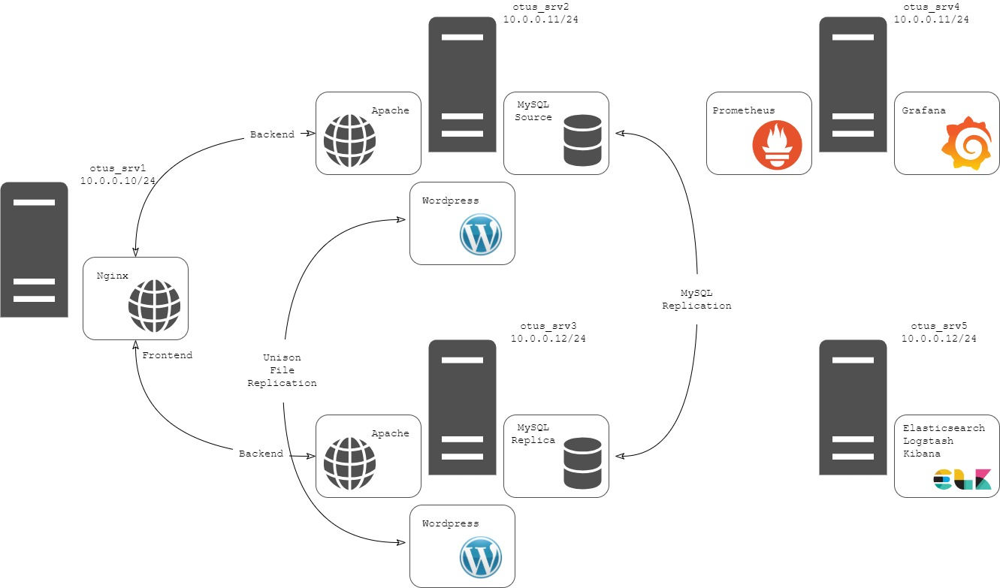

# otus_project
## Схема сети

## otus_srv1 (10.0.0.10)
**Frontend, Nginx**
- Frontend веб-сервер с использованием Nginx. Используется для трансляции запросов к Backend серверам.

## otus_srv2 (10.0.0.11)
**Backend, Apache, WordPress, MySQL Source**
- Backend веб-сервер 1 с использованием Apache, хостит WordPress с MySQL в качестве базы данных.
- Настроена CMS система WordPress с использованием СУБД MySQL.
- MySQL Source. Настроена репликация MySQL с сервером otus_srv3.
- Файлы WordPress синхронизированы с сервером otus_srv3 с использованием утилиты unison.

## otus_srv3 (10.0.0.12)
**Backend, Apache, WordPress, MySQL Replica**
- Backend веб-сервер 2 с использованием Apache, хостит WordPress с MySQL в качестве базы данных.
- Настроена CMS система WordPress с использованием СУБД MySQL.
- MySQL REplica. Настроена репликация MySQL с сервером otus_srv2.
- Файлы WordPress синхронизированы с сервером otus_srv2 с использованием утилиты unison.

## otus_srv4 (10.0.0.13)
**Prometheus, Grafana**
- Установлены Prometheus для мониторинга и Grafana для визуализации.

## otus_srv5 (10.0.0.14)
**ELK**
- Настроен стек ELK (Elasticsearch, Logstash, Kibana) для анализа логов Frontend веб спервера.  
## Ссылки
>**MySQL DB:** wordpress_db  
>**Пользователь MySQL:** wordpress  
>**Консоль администратора:** [http://10.0.0.11/wp-admin/](http://10.0.0.11/wp-admin/)  
>**FrontEnd:** [http://10.0.0.10/](http://10.0.0.10/)  
>**BackEnd 1:** [http://10.0.0.11/](http://10.0.0.11/)  
>**BackEnd 2:** [http://10.0.0.12/](http://10.0.0.12/)  
>**Grafana:** [http://10.0.0.13:3000/](http://10.0.0.13:3000/)  
>**Kibana:** [http://10.0.0.14:5601/](http://10.0.0.14:5601/)  

## Disaster Recovery Plan
Целью DRP является максимально быстрое восстановление всей серверной инфраструктуры из резервных копий, автоматизированное с помощью скриптов.

восстановить Srv2:
копируется wordpress
восстанаваливается mysql

восстановить srv3:
восстанваливается mysql
настраивается резервное копирование mysql

настраивается unison на srv2 и репликация 2 и 3
